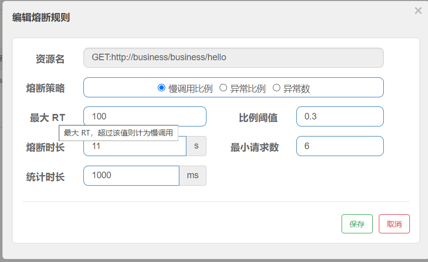

## 一、项目简介

### 1.系统核心功能

 

### 2.系统模块划分

 

 

### 3.数据库表的设计

 

 

 


## 二、部分实践记录

### 1、Mybatis多级缓存

- 一级缓存：

  - 开启：在方法上添加@Transactional注解之后，就会开启一级缓存。

  - 表现：同一个方法内执行两次一样的数据库查询，如果开启了一级缓存，那就只会查询一遍。生命周期只在存在于单次请求
  - 额外关闭：如果想要开启事务且额外关闭一级缓存，那就添加设置 **mybatis.configuration.local-cache-scope=statement**（默认是session）

- 二级缓存：

  - 开启：在对应的mapper下添加 **\<cache>\</cache>**标签，同时需要将对应的实体类实现序列化接口
  - 表现：生命周期只在存在于多次请求，但是如果出现了该命名空间（即mapper）下的任何增删改的接口执行，缓存就会失效


### 2、SpringBoot内置的缓存

- 开启：引入依赖，在启动类添加 **@EnableCaching** 注解，然后在指定的查询方法上添加 **@Cacheable（value=“自定义key”）**
  - 注意：方法的参数如果是自定义对象类，那必须重写hashcode和equals方法，因为他们会用来比较寻找缓存，否则同样参数请求也会重新查询数据库

- 实际使用：因为即便对于同一张表进行了增删改，该方法的查询缓存也一样不会更新，所以需要强制更新，那就需要配合 **@CachePut** 注解来使用

  - 如果有增删改操作了，就可以去调用添加了 **@CachePut** 注解的方法更新缓存

   


### 3、Redis缓存

- 开启：**沿用上面springboot缓存的配置**后，还需要将返回结果中的自定义类实现**序列化**接口，且额外配置：

  ```yacas
  省略了redis的主机地址
  
  spring.cache.type=redis
  spring.cache.redis.use-key-prefix=true
  spring.cache.redis.key-prefix=train_cache_
  spring.cache.redis.cache-null-values=true
  spring.cache.redis.time-to-live=60s
  ```

  

- **缓存击穿**：一个热点的KEY失效后，导致大量请求直接访问数据库
  
  - 可以增加定时任务，提前刷新缓存
  - 可以增加分布式锁，让没有抢到锁的请求返回 “请稍后” 或者一直等待到抢锁成功
- **缓存穿透**：客户端请求的数据在缓存中和数据库中都不存在，这样缓存永远不会生效，这些请求都会打到数据库
  - 允许缓存空对象： spring.cache.redis.cache-null-values=true
  - 分布式锁
- **缓存雪崩**： 在同一时段大量的缓存key同时失效或者Redis服务宕机，导致大量请求到达数据库，带来巨大压力。
  - 分布式锁无法解决，可以使用限流


### 4、前端Session缓存

- 定义

  

- 使用

 


### 5、Seata分布式事务

- 主要区分是否有两种行为：调度、自动编写补偿逻辑
- 项目使用的AT模式：需要在business和member模块额外添加两张undo_log表
  - 在不同数据库操作的方法上添加@GlobalTransactional

 


### 6、Redis分布式锁

- 使用redis原生的setnx的做法：
  - key的过期时间需要掌控（业务时间可长可短）
  - 如果在finally里deleteKey，那就会需要将获取锁的逻辑放到try外面（或者先判断是否是自己线程获得的锁），否则没抢到锁的线程会误删别人获取到锁
- 使用Redisson看门狗机制：
  - 获取到锁之后会有一个守护进程来监控剩余时间，不足20秒就重新设置key过期时间（key初始是30秒）
  - 释放锁的时候可以判断是否属于自己线程的锁


### 7、Sentinel限流

- 常见的限流算法

 


- **sentinel的限流应用（代码配置规则）**：

  - 需要在资源（方法或接口）上添加 **@SentinelResource(value = "自定义value", blockHandler = "自定义处理限流请求的方法名")**

  - 定义处理限流请求的方法（注意：该方法需要与资源方法的返回值和参数保持一致）

    ```java
    // 参数列表以资源的参数为基础，后面额外添加BlockException
    public void doConfirmBlock(ConfirmOrderDoReq req, BlockException e) {
            LOG.info("购票请求被限流：{}", req);
            throw new BusinessException(BusinessExceptionEnum.CONFIRM_ORDER_FLOW_EXCEPTION);
    }
    ```

  - 定义限流规则的方法：

    ```java
     private static void initFlowRules(){
            List<FlowRule> rules = new ArrayList<>();
            FlowRule rule = new FlowRule();
            rule.setResource("doConfirm");
            rule.setGrade(RuleConstant.FLOW_GRADE_QPS);
            // Set limit QPS to 20.
            rule.setCount(20);
            rules.add(rule);
            FlowRuleManager.loadRules(rules);
        }
    ```

  - 启动的时候调用限流规则的方法来初始化
  
- **流控的效果**

  - 快速失败
  - warm up （设置预热时间，在规定时间内达到阈值）
  - 排队等待（设置等待时间）

- **流控模式**

  - 直接

  - 关联（例如：A资源的流控规则必须在B资源的流控规则生效时才生效）

  - 链路（例如：对于同一个资源方法的调用，可以是多个接口请求调用的，但是必须是指定的链路调用才生效）

    ```properties
    # 流控模式是链路时，必须关闭这个配置，默认是true，为true时可以在控台-簇点链路界面看到所有请求都在一个链路下面
    spring.cloud.sentinel.web-context-unify=false
    ```


### 8、Sentinel熔断

> 三种熔断策略

- 慢调用比例

   

- 异常比例

   

- 异常数

   


> 熔断后的降级处理

 


### 9、下单时增加验证码

> 下单时增加前后端两层验证码来防止机器人抢票，削弱瞬时高峰


### 10、使用异步处理下单流程

- 用户下单之后，保存了初始订单记录之后，就发起异步线程调用，但是可以迅速返回结果，之后进行排队等待结果
  - 某一个异步线程拿到分布式锁之后，就会批量的查询并开始处理数据库中订单状态为初始的订单。
  - 用户得到快速返回结果之后，会定时地去查询数据库，判断自己的订单处理情况，期间就可以看到排队情况。


- Jmeter实测吞吐量 13 -> 330 ，响应时间所有环境都是逐渐上升的， 吞吐量的瓶颈不在于JVM的内存大小参数设置，即便多线程也能保持吞吐量
- 同样设定响应为2秒，并发线程线程数 45 -> 800


## 三、总结

本项目共有15张业务表，使用自制通用代码生成器，快速生成增删改查包含界面，减少重复编写增删改查代码的时间。
购票流程看起来简单，但用了几点高并发技术，比如10万人抢1000张票：

利用**分布式缓存**，在秒杀开始前，提供高性能余票查询，同时要考虑缓存击穿、穿透、雪崩等问题

使用**第一层验证码**，纯前端验证码在前端削弱瞬时高峰，将100毫秒内10万人的请求，分散成1~2秒内10万人请求

使用**第二层验证码**，后端验证码，进一步分散请求，同时防止机器人抢票

使用**限流技术**减轻无谓请求，同时给用户快速失败响应（告知票没有了或者稍后重试），将9万请求快速失败，变成1万请求抢1000张票

使用**分布式锁技术**，防止超卖，即2000人抢1000张票，最终只能卖出1000张，不能卖出1001张票

使用**异步削峰+排队机制**，解决吞吐量问题，实现最短时间内给用户反馈，1000请求告知票没有了，1000请求告知排队中

使用**分布式事务**，保证数据最终一致性，不能库存减少了，票却没打出来。
